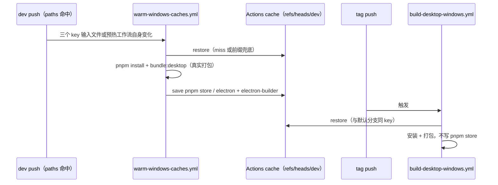

# Desktop Main 静态契约

## 规则与所有权

- Desktop Main 的独立 TypeScript 检查必须覆盖窗口、浏览器、存储及下载等入口；类型错误不能因为根工程检查通过而被视为通过。
- Main 创建 Local Host 的初始化消息必须包含内置供应商配置文件路径。窗口生命周期只生成其余字段，由 Main 的进程装配入口补齐路径后再发送给 Host。
- 跨包类型从公开入口导入；共享消息类型以 `@zcode/shared` 为事实源。类型修复不得新增运行时导入、常驻进程、轮询或遥测。
- 远程文件下载必须在请求前检查全部 DNS 解析结果，并将通过检查的地址绑定到实际连接；缺少下载数据时不得继续写入。
- 浏览器动作按判别字段缩小类型后执行；关闭或已销毁的页面不能继续派发动作。

## 静态验收

1. `pnpm exec tsc -p packages/desktop/tsconfig.main.json --noEmit --pretty false` 的诊断按文件与原因归类；修复后与原有 81 条诊断比较。
2. 窗口创建消息的必需字段由 Main 补齐，Host 接收的完整消息类型保持严格。
3. DNS 校验与连接地址绑定、浏览器动作分支、已销毁页面处理保持上述规则。
4. 只运行静态检查，不运行应用、单测、E2E 或构建。

## CI 静态门禁

- `.github/workflows/check.yml` 的 Typecheck job 先运行现有根 `pnpm typecheck`，再在同一 job 运行 Desktop Main 的 `tsc --noEmit`。后一步依赖前一步生成的 shared/services 声明；两步必须顺序执行，不新增桌面制品构建。
- Windows 发布工作流在现有根类型检查之后也执行 Main 的无输出检查，避免长时间打包之后才发现 Main 类型错误。
- CLI bootstrap 的本地 `tsc --noEmit` 虽通过，但它依赖多个 CLI workspace 包的 `dist/*.d.ts`。这些声明不入库，干净的 CI 安装又跳过构建脚本；本次不能把该命令直接作为 PR 门禁。保持 CLI 构建/类型检查策略不变，待建立无产物的依赖解析入口后再加入。
- 三个 workflow 都通过 `jdx/mise-action` 读取根目录 `mise.toml`，固定 Node `24.21.0` 和 pnpm `11.27.1`；这是项目工具链版本。GitHub Action 自身的 Node runtime 独立于项目 Node，应使用支持 Node 24 的 checkout、cache 和 artifact action。
- pnpm store 的 key 由 runner OS、根 `pnpm-lock.yaml` 哈希与根 `mise.toml` 哈希共同决定。`mise.toml` 组件代表 store 布局版本：pnpm store 按主版本分子目录，若只对 lockfile 取哈希，工具链升级而 lockfile 未变时会得到「精确命中但布局不兼容」的死缓存，且 `cache-hit == 'true'` 会永久跳过保存。三个 workflow 的该 key 公式必须逐字符一致。
- Linux store 由 `.github/workflows/check.yml` 的矩阵 job 写入。恢复与保存分开：依赖安装成功后立即保存 store，使后续类型检查失败也不会丢失已下载依赖。矩阵 job 并发争用同一 key 时允许一个 job 保存，其他 job 复用已存在条目。
- Windows store 由默认分支上的 `.github/workflows/warm-windows-caches.yml` 独占写入，Windows 发布工作流只恢复、不保存。每个 tag 各存一份 store 会在 tag 作用域堆积同一 key 的重复副本，顶穿仓库 10 GB 上限并挤掉默认分支的有效条目。
- Electron 与 electron-builder 缓存按 runner OS 和桌面依赖恢复。预热工作流会真实打包一次，因此 Electron 二进制与 electron-builder 的 nsis/winCodeSign 工具都在默认分支侧填好；发布工作流保留冷启动降级保存，使默认分支条目缺失时已下载的文件仍能缓存。缓存 action 会跳过空目录。
- GitHub 按 ref 隔离缓存：run 只能读取「自身 ref」与「默认分支」两处条目，不同 tag 之间互不可见，且 tag 触发的 run 会把条目写进隔离作用域（实测 ref 形如 `refs/heads/refs/tags/<tag>`）。共享条目必须位于默认分支（`dev`）才能被任意 tag 读取，该作用域由预热工作流独占。
- 预热工作流的默认分支守卫用 `github.ref_name == github.event.repository.default_branch`，不把分支名写死在 workflow 里。`repository.default_branch` 是 push 与 `workflow_dispatch` 载荷里 `Repository` 的必填字段，因此该判定是确定性的：默认分支上为真，手动选到 tag 或其他分支时为假、job 跳过，不会把条目写进无人复用的作用域。首次运行的 `Cache not found` 是冷缓存提示；已保存的相同 key 可在同一 ref 或默认分支内恢复。

### 缓存作用域与命中验收

- 预热工作流的触发路径包含三个 key 输入文件与工作流自身。包含自身的目的是让它在首次落地或被修改时自动预热一次：否则依赖未变、但缓存尚未建立或已被清空（例如清缓存排障、7 天未访问淘汰）时，只能靠手动 dispatch 才不会让下一个 tag 冷启动。该条目不参与 key 计算，只影响触发。

1. 正路径：预热在默认分支完成后，tag 构建的 `Restore pnpm store` 显示 `Cache restored from key:` 而非 `Cache not found for input keys`，且该构建不再执行 `Save pnpm store`。
2. 正路径：tag 构建的 Electron 缓存保存步骤被跳过（精确命中）。该步骤再次变成 success 表示 key 输入变化或默认分支条目缺失，属健康信号而非错误。
3. 正路径：缓存为空时，向默认分支推送三个 key 输入文件之一、或推送预热工作流自身的改动，都会自动触发一次预热并把条目写进默认分支作用域。
4. 反路径：key 输入变化（lockfile 或 `mise.toml`）时 tag 构建落后一层，按 `restore-keys: pnpm-Windows-` 前缀恢复旧 store 做增量安装；预热工作流随即补齐新 key 条目。
5. 反路径：默认分支条目被 7 天未访问淘汰、或依赖改完立即打 tag 而预热尚未完成时，发布构建冷装一次并写一份该 tag 作用域副本供该 tag 重跑使用；手动 dispatch 预热工作流即回到稳态。
6. 失效判据：`refs/heads/refs/tags/*` 下重新出现 pnpm store 条目，说明 tag 侧保存被恢复，仓库空间会再次被重复副本顶穿。

## 本次诊断处理

- 81 条原有 Main 诊断中，窗口初始化消息、公开类型入口、下载地址与数据校验、浏览器动作与页面生命周期、存储 Worker 类型、Chrome helper 进程类型等均可按现有所有者修正；保持现有运行顺序和进程数量。
- ARMS 是远程遥测。当前构建删除 Main 的 ARMS 启动模块与专用共享源文件，不等待 SDK 初始化，也不更新 ARMS 用户身份；其他遥测入口继续由编译期关闭开关约束。
- 实时流的 `taskStreamMirrorableEventSchema` 只校验公共字段并允许额外字段，不能证明解码后的对象满足 `TaskStreamMirrorableEvent` 的全部分支。两个 Host 消息分发调用点沿用既有宽松运行时协议，按用户授权使用有原因的 `@ts-expect-error` 标记这项已知类型债务，不用 `as` 强制断言，也不改变消息内容或校验行为。后续类型契约对齐后，这两个标记必须因变成未使用而被移除；收紧协议时只需覆盖 Desktop 实时流，手机恢复流（`PHONE_REMOTE_DISABLED`）已永久禁用、无需保留兼容。
