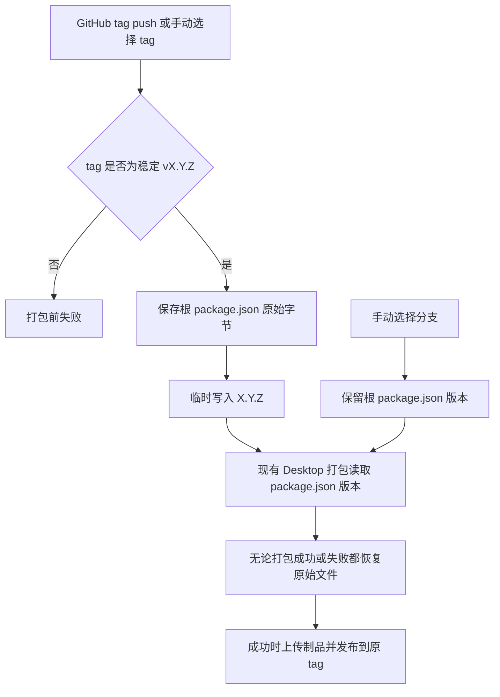

# Desktop 发布版本以 tag 为准

## 范围与所有权

- 规则只作用于 `.github/workflows/build-desktop-windows.yml` 的 Desktop Windows 发布构建。
- `apps/zcode-cli` 继续使用自己的 `package.json` 版本和既有发布流程。
- 发布 workflow 是版本覆盖的唯一所有者。Desktop 构建 metadata 从 workspace 根目录 `package.json` 读取产品版本；workflow 在打包命令执行期间临时覆盖该字段。
- GitHub Release 仍使用原始 tag 作为 release 标识；版本覆盖不创建或推送 Git commit，也不修改 `pnpm-lock.yaml`。

## 版本规则与事件顺序

- tag push 和手动选择 tag 的 `workflow_dispatch` 都使用所选 tag 作为产品版本来源。
- 只接受稳定版 `vX.Y.Z`，其中三个数字段均为合法十进制 SemVer 数字段；去掉前缀 `v` 后写入根 `package.json` 的 `version`。
- 手动选择分支时保留仓库中的根 `package.json` 版本，不做覆盖。
- 版本校验和临时写入发生在依赖安装、类型检查和 lint 之后、Desktop 打包之前。打包步骤保存根 `package.json` 原始字节，并在打包成功或失败后恢复原始内容。
- tag 不符合格式时，在启动打包前失败；不上传制品，也不发布 GitHub Release。

## 验收场景

1. 推送 `v1.2.3`：打包期间根 `package.json` 的产品版本为 `1.2.3`；构建 metadata、Electron 应用版本和安装包文件名都使用 `1.2.3`；步骤完成后根文件恢复原内容，制品发布到 `v1.2.3`。
2. 手动选择 `v1.2.3` 运行 workflow：行为与 tag push 相同。
3. 手动选择分支运行 workflow：使用检出分支中原有的根 `package.json` 版本。
4. 使用 `v1.2.3-rc.1`、`v01.2.3` 或其他不符合稳定 `vX.Y.Z` 的 tag：在打包前失败，不生成制品或 GitHub Release，根 `package.json` 保持不变。
5. workflow 不执行 git commit 或 git push；CLI 版本和 `pnpm-lock.yaml` 保持不变。

## 人工验收步骤

1. 手动运行 workflow 并选择一个符合格式的 tag，检查打包步骤使用去掉 `v` 的版本，检查安装包文件名与应用元数据，并确认发布目标仍为完整 tag。
2. 手动运行 workflow 并选择分支，确认版本仍来自该分支的根 `package.json`。
3. 以预发布或格式错误的 tag 手动运行，确认打包未启动且发布步骤未运行。
