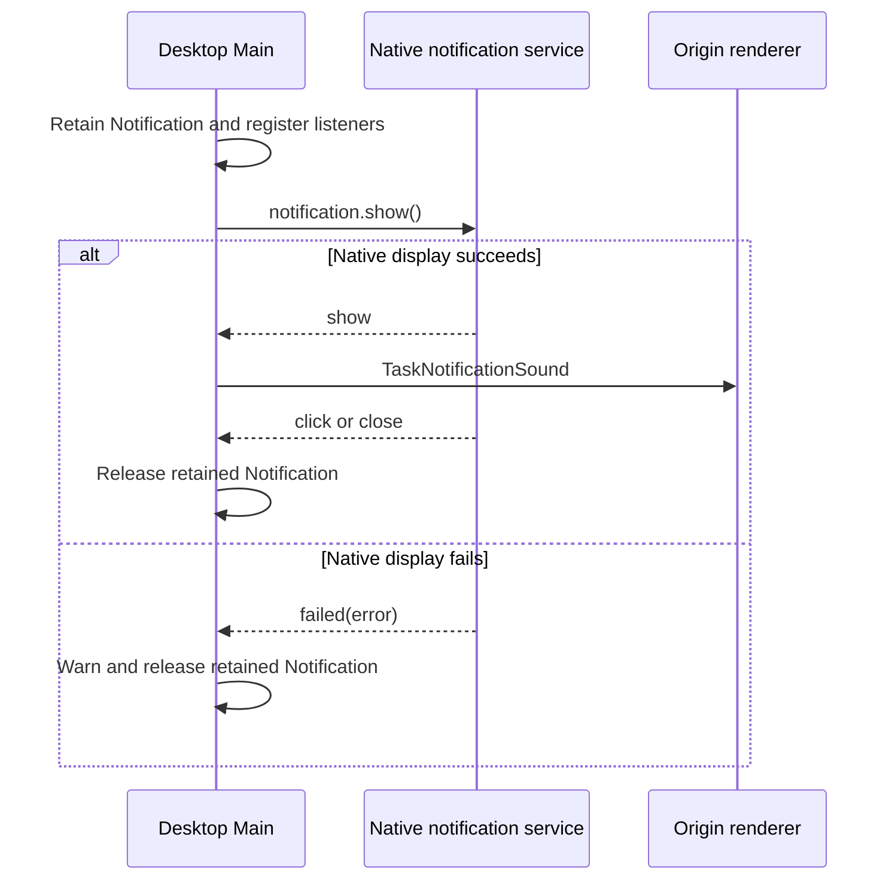

# Toolchain upgrade: Electron 44 and pnpm 11

## Product rule and ownership

- The repository pins its development Node.js runtime to `24.21.0` and pnpm to the latest available `11.x` patch (`11.27.1`). Root and nested CLI workspace declarations must agree with these pins.
- The Desktop package pins Electron to `44.4.4`; its packaging configuration derives `electronVersion` from that manifest so development, type resolution, and packaging share one runtime owner.
- The root workspace and `apps/zcode-cli` each own a lockfile. The CLI workspace includes its six local dependencies from `../../packages`; regenerate both lockfiles with pnpm 11 after its manifest/configuration migration.
- Each workspace root retains only registry/auth options in its own `.npmrc`; root and CLI registry selection is pinned to official npm so the nested CLI workspace does not fall back to the user registry. Electron and electron-builder platform binaries are separate release artifacts and are downloaded from their official GitHub Releases URLs, not npm registry mirrors. Other remote runtime asset distribution remains outside this toolchain migration.
- pnpm workspace configuration is owned by each `pnpm-workspace.yaml`. `.npmrc` retains only registry/auth configuration. The local machine's globally installed Node.js and pnpm are not part of this change.

## Invariants and migration boundary

- Pin project Node.js in `mise.toml`, `.nvmrc`, and the CLI's `.nvmrc` / `.node-version`; keep the CLI runtime declaration and user-facing version references aligned.
- Pin pnpm in both workspace `packageManager` declarations and `mise.toml`.
- Move `overrides` and `patchedDependencies` out of root `package.json#pnpm` into root `pnpm-workspace.yaml`; move `node-linker=hoisted` out of `.npmrc` into workspace YAML settings for both workspaces.
- Set `minimumReleaseAge: 0` in both project workspace YAML files so fresh releases can install; do not change user-level or machine-wide pnpm configuration.
- Keep GitHub Actions on the same Node and pnpm pins by loading `mise.toml`; cache the root pnpm store from `pnpm-lock.yaml` and Electron binaries from the Desktop manifest. The Windows packaging workflow downloads Electron and electron-builder binaries directly from their official GitHub Releases base URLs.
- Keep the third-party notice generator aligned with the new workspace-owned `patchedDependencies` declaration.
- Preserve existing root workspace package lists, architecture filters, build approvals, React overrides, patch files, and registry selection. The CLI workspace must also include its referenced local provider, shared, model-option-map, CUA, and formal-proof packages.
- Refresh Node runtime license metadata for the project-pinned Node `24.21.0` and keep generated third-party notices/inventory consistent with the lockfile and installed production graph.
- Refresh dependency license inventory alongside the Electron change; when an upstream package ships only a license identifier, preserve that evidence and record the missing complete license text instead of inventing an upstream notice.
- Do not run global tool upgrades or `mise install`; the migration updates project declarations and project lockfiles only.

## Compatibility boundary

- Electron 44 no longer exposes its clipboard module in renderer processes. Existing renderer clipboard actions must stay on the browser `navigator.clipboard` API; do not add renderer access to Electron clipboard.
- Electron 44 requires macOS 13 or later and publishes only x64/arm64 builds. Keep the repository's existing x64/arm64 platform scope and update any explicit macOS 12 compatibility claim if one exists.
- Electron 44.4.4's release notes include fixes only; no additional app behavior is requested by this version bump.

## Electron 42–44 runtime compatibility follow-up

- `desktopNotifications.ts` owns each native task notification and its retained lifetime. Keep the object until activation/close, and release it on Electron's `failed` event as well.
- Electron 42's macOS `UNNotification` backend requires a code-signed app. When native notification display fails, log the failure and release the retained object. Keep the existing fire-and-forget IPC contract; send the task notification sound only after Electron emits `show`.
- The browser renderer uses `navigator.clipboard`; main-process code does not use Electron's reworked clipboard API. Electron 44's clipboard migration therefore requires no other clipboard adapter.
- The Linux main window intentionally remains frameless and transparent around the renderer's rounded root surface. Accept Electron 43's native rounded-corner default; keep the update-status window's explicit square-corner choice separate.
- Electron 43's download-folder default is compatible with the embedded browser's `will-download` handler, which uses the actual `DownloadItem` save path. Electron 43's `chrome.scripting` and `dialog.showHiddenFiles` changes have no matching application call sites. The app configures Window Controls Overlay on Windows only; the Linux-specific layout change does not apply.
- Electron 44's client-certificate event, frame-navigation `net.request` restriction, Unity API removal, and dynamic ANGLE-library replacement behavior have no matching application call sites or packaged ANGLE overrides.
- The packaged Desktop main process and `ELECTRON_RUN_AS_NODE` agent use Electron 44's embedded Node 24.18.1; development scripts and the standalone CLI use the pinned Node 24.21.0. The project uses the existing Node 24 API surface and has no use of the detached-`ArrayBuffer` Buffer validation behavior changed in 24.21.0.

### Notification delivery and ownership

Acceptance scenarios:

1. On an unsigned macOS build, a task notification failure emits one warning, releases the retained object, and does not play the task notification sound.
2. When a notification is shown, the originating live renderer receives one task notification sound; click still restores/focuses its window, and click/close releases the retained object.
3. On Linux, the main window remains frameless with native rounded corners around the renderer's existing rounded root; the update-status window remains explicitly square-cornered.

## Desktop ASAR repack after the pnpm 11 migration

- Desktop packaging owns the staged `app.asar` rewrite in `afterPack`. Rewrite when runtime modules or the packaged target prebuild are missing. Before packing, the staging tree must contain the target platform's `node-pty/prebuilds/<platform>/pty.node`; its installed `node-pty` package is the source if the extracted archive omitted that directory. Copy the complete target prebuild directory so its runtime helper files stay together.
- Every runtime module required by the final `bundle.mjs` archive check must also be an `afterPack` injection root. In particular, the Desktop manifest's `@babel/runtime` dependency must be copied from the installed package when electron-builder omits it from `app.asar`; a final verifier requirement alone cannot repair the archive.
- Keep the candidate archive and `.unpacked` sidecar as one replacement unit. If the source target prebuild is unavailable, fail with a specific error before replacing the current archive. Preserve the existing native-resource and target-prebuild checks after repacking.
- The package layout may differ between pnpm versions; the archive extraction is not the owner of native assets when the installed target prebuild is available.

Acceptance scenarios:

1. A Windows x64 package whose extracted archive lacks `node-pty/prebuilds/win32-x64` copies that target directory from the installed package, then produces both `app.asar.next` and `app.asar.next.unpacked`.
2. A package whose extracted archive already contains the target prebuild does not replace it from the install tree.
3. A missing prebuild in both the extracted archive and installed package fails before the current `app.asar` and sidecar are replaced.
4. The final package contains only the target platform's node-pty prebuild and passes the existing native-resource policy checks.
5. Missing target native assets trigger the rewrite even when all runtime modules are present.
6. When electron-builder omits `@babel/runtime`, `afterPack` injects its package before the installer is generated, and the final runtime-dependency check finds it in `app.asar`.

## Acceptance scenarios

1. A developer entering the repository can select Node `24.21.0` and pnpm `11.27.1` from project pins without changing machine-wide installations.
2. A root workspace install resolves Electron `44.4.4`, and the packaging configuration names that same version.
3. An install in `apps/zcode-cli` resolves every declared local workspace dependency and uses pnpm `11.27.1`, Node `24.21.0`, and its refreshed lockfile.
4. Existing overrides, patches, architecture selection, build approvals, and official npm registry remain effective after moving pnpm settings in both workspace roots.
5. Static validation reports no new type, lint, formatting, or architecture errors. Application launches, package builds, unit tests, and E2E tests are outside this migration's validation boundary.
6. The generated third-party inventory includes the new Electron dependency graph and explicitly records any upstream license material that is incomplete.
7. Both project workspaces resolve without a release-age cutoff while the machine-wide pnpm release-age setting remains unchanged.
8. GitHub Actions selects Node and pnpm from the repository pins, restores caches keyed by the changed root lockfile/Desktop Electron manifest, and uses official npm for packages plus the official GitHub Releases for Electron packaging binaries.
